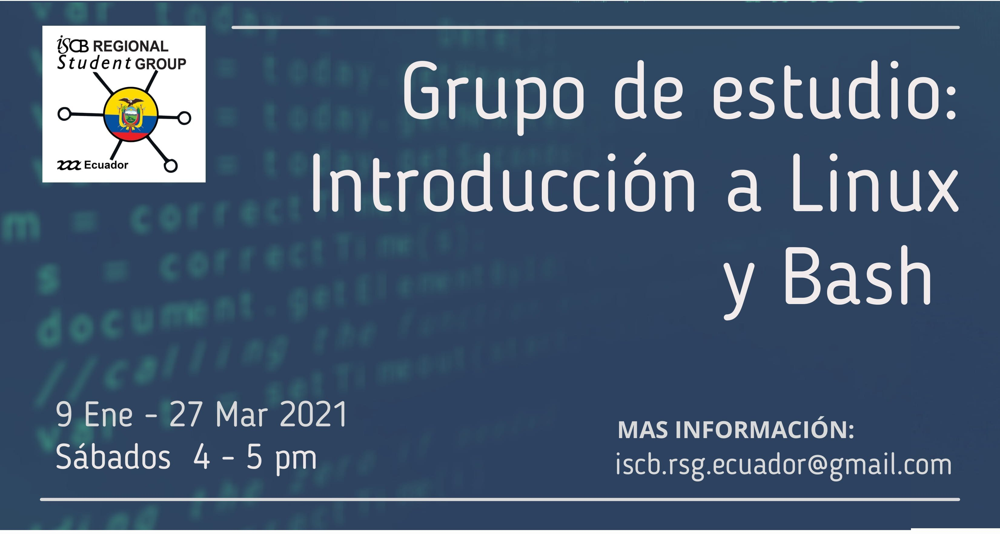
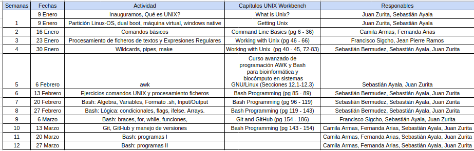
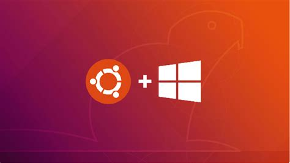
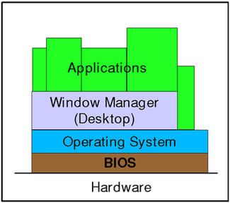
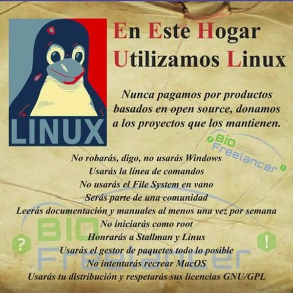

# **BIENVENIDOS**

## **Calendario y forma de trabajo del grupo de estudio**

## **Libro de referencia**

## **Calendario con secciones del libro por semana para leer**

## **Certificado**
1. 70% asistencias (8 sesiones)
2. 70% de pruebas cortas del tema (8)
3. 70% de deberes (8)

# **¿Qué es UNIX?**
* Sistema operativo (SO) creado por **Ken Thompson y Dennis Ritchie** de la empresa *Bell Laboratories* en 1969.
* SO multitarea y multiusuario.
* La mayoría de SO basados en UNIX hasta 1980 eran comerciales, se usaban por empresas y universidades. 
* Algunos ejemplos: Solaris, HP/UX, BSD, Mac OS X, GNU/Linux, entre otros.

## **GNU/Linux**
* En 1983 **Richard Stallman** lideró la iniciativa [GNU](https://www.gnu.org/) (GNU's Not Unix), SO compatible con UNIX de libre distribución y acceso sin restricciones al código fuente.
* En 1991 **Linus Torvalds** creó su propio [kernel](https://linuxjourney.com/lesson/kernel-overview) (Linux), que es la parte del SO que permite la comunicación con los componentes de Hardware. Este kernel fue distribuido de forma libre y gratuita.
* Ambos proyectos se juntaron y se creó **GNU/Linux**

## **Filosofía GNU/Linux**
* Los usuarios son libres de **ejecutar, copiar, distribuir, estudiar, cambiar y mejorar** el software.
* El [software libre](https://www.gnu.org/philosophy/free-sw.html) se refiere a las libertades mencionadas, no al precio.
* ["open source"](https://opensource.org/) vs ["free software"](https://www.gnu.org/philosophy/free-sw.html).

## **Distribuciones GNU/Linux**
* Tienen en común el **kernel Linux**, **software por defecto de GNU** y otras herramientas como editores de texto, etc.
* Difieren en el software de instalación (apt, pacman, entre otros), aplicaciones de oficina, exploradores web, documetación, costo, calidad del software, soporte de la comuidad, facilidad de uso, entre otras. 

## **Ubuntu**
* Una de las distribuciones de GNU/Linux más populares.
* Está basada en [Debian](https://www.debian.org/) y fue desarrollada por la empresa [*Canonical*](https://canonical.com/)
* Facilidad de uso e instalación. 
* Interfaz de usuario amigable. 

# **Shell**
* La [*shell*](https://en.wikipedia.org/wiki/Unix_shell) es el programa que provee una **interfaz de línea de comandos (CLI)**, que permite la comunicación entre el usuario y el SO. 
* La mayoría de distribuciones de Linux tienen por defecto [*bash*](https://en.wikipedia.org/wiki/Bash_(Unix_shell) ("Bourne Again SHell") como *shell*. Hay [otros tipos de shell](https://www.educba.com/types-of-shells-in-linux/) como **sh, csh, tcsh, ksh, zsh**, entre otras. 

## **Emuladores de terminal**
* Un [*emulador de terminal*](https://en.wikipedia.org/wiki/Terminal_emulator) es un programa que permite **interactuar con la shell**. De forma general, se le llama **terminal**. 
* Algunos ejemplos de emuladores de terminal son: **terminator, tilda, guake, terminology**, entre otros. 

## **Formas de acceder a un emulador de terminal de bash**
1. Máquina virtual 

2. Subsistema de Windows 10 para Linux (WSL)

3. Dual boot

4. Live USB con persistencia de datos

5. Instalación de SO en USB o disco externo

# **1. Máquina virtual (MV)**
* Permite ejecutar un **SO (invitado)** dentro de otro **SO (host)**.
* Memoria RAM y almacenamiento en disco se comparten entre SO invitado y host.
* El SO se instala en una **partición virtual del disco duro**. 
* Funciona bien para ejecutar programas y comandos sencillos, pero tiene limitaciones por el consumo de recursos del SO, memoria RAM y otros. Además, la transferencia de archivos puede ser complicada.  
* Existen varios programas para crear MVs como **Hyper-V, VirtualBox, Parallels, WMware, Vagrant**, entre otros. En este caso mostraremos cómo se realiza este proceso con VirtualBox.

## **Pasos**
1. Descargar [VirtualBox](https://www.virtualbox.org/), disponible para Windows, Linux, y Macintosh.
2. Descargar [VirtualBox Extension Pack](https://www.virtualbox.org/wiki/Downloads). Una vez instalado VirtualBox, añadir el **Extension-pack**. 
3. Descargar una **imagen ISO** del SO deseado, en este caso de [Ubuntu 20.04](https://ubuntu.com/download/desktop). En esta [página](https://www.linuxlookup.com/linux_iso) hay imágenes de otros SO si están interesados. 
4. Crear una MV de Ubuntu 20.04 con VirtualBox. Se debe especificar la **memoria RAM, almacenamiento de disco, número de procesadores** y otras características. 

En este [video](https://www.youtube.com/watch?v=x5MhydijWmc) hay una explicación en detalle de todo el proceso. 

# **2. Subsistema de Windows 10 para Linux (WSL)**
* Se instala **SO Linux como aplicación de Windows 10**. 
* Permite ejecutar comandos de Linux usando **bash**. 
* Es posible instalar **aplicaciones de línea de comandos GNU/Linux** en Windows 10 
* Se puede acceder y manejar el sistema de archivos y las unidades de almacenamiento de Windows 10 dentro del emulador de terminal de WSL.
* No se puede trabajar con **aplicaciones de interfaz gráfica de usuario (GUI)**. 

## **WSL1 vs WSL2**
* En **WSL1** los comandos se corren en **kernel de Windows**, mientras que en **WSL2** hay un **kernel de Linux virtualizado**.
* Para la virtualización WSL2 utiliza la tecnología de **Hyper-V**. 
* WSL1 tiene limitaciones en la compatibilidad con aplicaciones basadas en kernel de Linux como Docker y otras, lo que es posible realizar con WSL2. 
* En WSL2 la transferencia y acceso de archivos es hasta 20 veces más rápido que con WSL1.

En este [artículo](https://fossbytes.com/what-is-windows-subsystem-for-linux-wsl/) se explican en detalle las diferencias entre WSL1 y WSL2.

## **Pasos instalación WSL2**
**1.-** Habilitar el **subsistema de Windows para Linux**. Correr en la *powershell* el siguiente código: 
> dism.exe /online /enable-feature /featurename:Microsoft-Windows-Subsystem-Linux /all /norestart

**2.-** Actualizar SO para correr WSL2.
   * Para **sistemas x64**: versión 1903 o superior, con compilación 18362 o superior.
   * Para **sistemas ARM64**: versión 2004 o superior, con compilación 19041 o superior.
   * Las **versiones anteriores a 18362** no admiten WSL 2. Utilice el Asistente de actualización de Windows para actualizar su versión de Windows.
   
**3.-** Habilitar la **función de máquina virtual**. Correr en la *powershell* el siguiente código: 
> dism.exe /online /enable-feature /featurename:VirtualMachinePlatform /all /norestart

**4.-** Descargar el [paquete del kernel de Linux](https://wslstorestorage.blob.core.windows.net/wslblob/wsl_update_x64.msi) y correr el programa. 

**5.-** Establezcer **WSL2 como versión predeterminada**. Correr en la *powershell* el siguiente código: 
> wsl --set-default-version 2

**6.-** Instalar la **distribución de Linux de preferencia** mediante la **tienda de Windows** (Ubuntu, openSUSU, Kali, entre otros). Para este curso se utilizará [Ubuntu 20.04](https://www.microsoft.com/en-us/p/ubuntu-2004-lts/9n6svws3rx71?rtc=1&activetab=pivot:overviewtab).

En esta [página](https://docs.microsoft.com/en-us/windows/wsl/install-win10) de **Microsoft** hay una explicación en detalle de todo el proceso y cómo solucionar posibles errores. 

## **MV vs WSL**
* Una máquina virtual está **aislada**. Lo que esto significa es que no podrá acceder a archivos fuera del sistema virtual.
* **Rendimiento y arranque:** En MV se accede al hardware real solo a través del SO, lo que genera problemas de rendimiento. Las MVs son tan poderosas como su hardware se lo permita.
* **Uso de memoria:** siempre que se use una MV se debe dedicar una gran parte de la memoria en todo momento.
* **Gestión:** MV tiene SO que requiere gestión.
* **GUI**: MV permiten GUI y WSL no. 

# **3. Dual boot**
* Instalación de dos **SO diferentes en una misma computadora**. 
* Los dos SO ocupan un **espació físico en el disco duro**. 
* El hardware (memoria RAM, procesadores, tarjetas gráficas, entre otros) se usa completamente por el SO en el que se inicia el equipo. 
* Solo se puede **usar uno de los SO a la vez**.

## **¿Cómo funciona el Dual-boot?**
* Un SO es un programa que ocupa un espacio físico en memoria. Si se instala más de un SO se debe **particionar el disco duro**, de forma que a cada uno tenga una partición independiente. 
* La [BIOS](https://www.lifewire.com/bios-basic-input-output-system-2625820) es un conjunto de programas que están almacenados en la **placa madre**, que controlan las **instrucciones de inicio de la PC**. 
* Cuando se inicia una PC la BIOS carga el *boot loader* desde el disco duro y esto permite que se muestren los SO instalados. Este programa es diferente para cada SO ([Windows Boot Manager](https://www.lifewire.com/windows-boot-manager-bootmgr-2625813) para Windows, [Apple boot camp](https://www.computerhope.com/jargon/b/bootcamp.htm) para Mac, y [GRUB](https://www.computerhope.com/jargon/g/grub.htm) para Linux). 

## **Pasos instalación Windows-Ubuntu Dual boot**
1. Hacer un **respaldo de tu información** en un disco duro externo o en la nube. 
2. Realizar **particiones del disco duro para cada SO** (En Windows se puede usar el **administrador de discos** por defecto o en Linux [GParted](https://gparted.org/)). Se recomienda un tamaño de **al menos 100 GB para Ubuntu**.
3. Descargar una **imagen ISO** del SO deseado, en este caso de [Ubuntu 20.04](https://ubuntu.com/download/desktop). En esta [página](https://www.linuxlookup.com/linux_iso) hay imágenes de otros SO si están interesados. 
4. Hacer un **USB de arranque** de Ubuntu en Windows, lo que se puede realizar con el programa [Linux Live USB Creator](http://www.linuxliveusb.com/en/home) u [otros programas](https://fossbytes.com/top-5-bootable-usb-tools-for-windows-os/) para este fin. 
5. Reiniciar la PC con la USB de arranque conectada, presionar la tecla (F2, F12 u otra dependiendo del equipo) para mostrar el *boot menu* y seleccionar **almacenamiento USB**. 
6. Seleccionar **instalar Ubuntu** en el menú de instalación y seguir los pasos correspondientes. 
7. Crear un **esquema de partición para Ubuntu**
    * Las **particiones NTFS** son propias de Windows.
    * Particiones **root (ext4), home (ext4) y swap** de Ubuntu (puede variar).
8. Realizar configuraciones finales y está listo !

En este [artículo](https://fossbytes.com/install-ubuntu-20-04-with-windows-10-dual-boot/) pueden encontrar información detallada del proceso **dual boot Windows-Ubuntu**, y [aquí](https://linuxnewbieguide.org/how-to-install-linux-on-a-macintosh-computer/) sobre **dual boot macOS-Ubuntu**.

## **Dual boot vs WSL**

# **4. Live USB Linux con persistencia de datos**
* **SO Linux portátil en una USB**, que se puede utilizar en diferentes computadoras. 
* **No se instala SO** como tal, sirve como una versión de prueba para **probar distribuciones**. 
* Es posible almacenar archivos e instalar programas, que son almacenados en la USB. 
* No se recomienda esta alternativa como un **SO de producción**, solo de prueba. 

## **Pasos instalación Live USB Linux con persistencia de datos**
1. Descargar una **imagen ISO** del SO deseado, en este caso de [Ubuntu 20.04](https://ubuntu.com/download/desktop). En esta [página](https://www.linuxlookup.com/linux_iso) hay imágenes de otros SO si están interesados. 
2. Hacer un **USB de arranque** de Ubuntu en Windows, lo que se puede realizar con el programa [Linux Live USB Creator](http://www.linuxliveusb.com/en/home) u [otros programas](https://fossbytes.com/top-5-bootable-usb-tools-for-windows-os/) para este fin. Se debe establecer el **espacio de almacenamiento persistente** en la USB.
3. Reiniciar la PC con la USB de arranque conectada, presionar la tecla (F2, F12 u otra dependiendo del equipo) para mostrar el *boot menu* y seleccionar **almacenamiento USB**. 
4. Seleccionar **probar Ubuntu** en el menú de instalación y seguir los pasos correspondientes.

En este [artículo](https://www.howtogeek.com/howto/14912/create-a-persistent-bootable-ubuntu-usb-flash-drive/) pueden encontrar una guía detallada del proceso. 

# **5. Instalación de SO en USB o disco externo**
* **SO Linux portátil** en una USB o disco externo, que se puede utilizar en diferentes computadoras. 
* **Se instala SO** en la USB o disco externo. 
* Es posible almacenar archivos e instalar programas, que son almacenados en la USB o disco externo. 

En este [artículo](https://www.58bits.com/blog/2020/02/28/how-create-truly-portable-ubuntu-installation-external-usb-hdd-or-ssd) pueden encontrar una guía detallada del proceso. Además, en esta [página](https://www.maketecheasier.com/persistent-live-usb-vs-full-install-usb/) se explica las diferencias entre las alternativas 4 y 5. 

# **Referencias**
* Kross, S. (2017). *The unix workbench*. Leanpub. https://leanpub.com/unix
* Ross, A. (2019). *The Ultimate Linux Newbie Guide*. https://linuxnewbieguide.org/
* Shotts, W. (2019). *The Linux command line: a complete introduction*. No Starch Press. http://www.linuxcommand.org/tlcl.php/index.php 
* Linux Journey. (2020). Linux Journey. https://linuxjourney.com/
* GNU. (2020). GNU. https://www.gnu.org/
* Mithran, A (2020). What is Windows Subsystem for Linux (WSL and WSL2)? — Linux in Windows. https://fossbytes.com/what-is-windows-subsystem-for-linux-wsl/
* Buckler, C (2020). Windows Subsystem for Linux 2: The Complete Guide. https://www.sitepoint.com/wsl2/
* Microsoft. (2020). Windows Subsystem for Linux Installation Guide for Windows 10. https://docs.microsoft.com/en-us/windows/wsl/install-win10
* Hoffman, C (2020). How to Create a Live Ubuntu USB Drive With Persistent Storage. https://www.howtogeek.com/howto/14912/create-a-persistent-bootable-ubuntu-usb-flash-drive/
* Hoffman, C (2017). Dual Booting Explained: How You Can Have Multiple Operating Systems on Your Computer. https://www.howtogeek.com/187789/dual-booting-explained-how-you-can-have-multiple-operating-systems-on-your-computer/
* Kumar, S (2020). How To Dual Boot Ubuntu 20.04 With Windows 10? [Using Bootable USB]. https://fossbytes.com/install-ubuntu-20-04-with-windows-10-dual-boot/
* Oh, D. (2013). The Differences Between Persistent Live USB and Full Linux Install on USB. https://www.maketecheasier.com/persistent-live-usb-vs-full-install-usb/
* Bouch, A. (2020). How to Create a Live Ubuntu USB Drive With Persistent Storage. https://www.howtogeek.com/howto/14912/create-a-persistent-bootable-ubuntu-usb-flash-drive/

